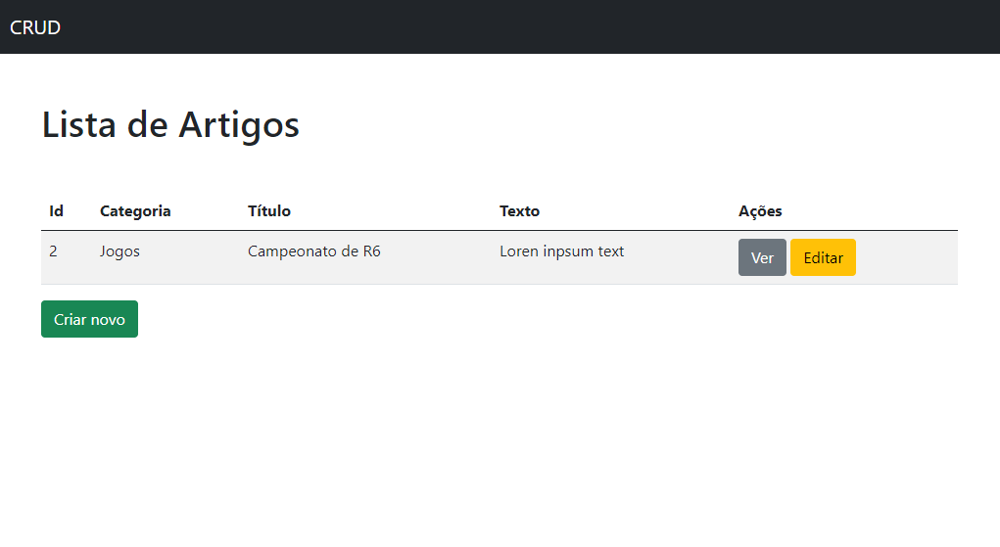

<h1 align="center">Symfony 5 CRUD Basic Example</h1>

  

## Project

This basic project with Symfony 5 was built as part of a university activity.

## Technologies

This project was developed with the following technologies:

- [PHP 8.0.6](https://www.php.net/)
- [Doctrine ORM](https://symfony.com/doc/current/doctrine.html)
- [MySql](https://www.mysql.com/)
- [Symfony CLI](https://symfony.com/download)

## How to run

- Clone the repository
- Access project directory
- Change the data of the "DATABASE_URL" environment variable in the .env file
- Install dependencies with `composer install`
- Synchronizing package.json with PHP packages, run `npm install --force` or `yarn install --force`
- Create the database with `php bin/console doctrine:database:create`
- Create the tables in the database with `php bin/console doctrine:migrations:migrate`
- Compile the project with `yarn run encore dev` or `npm run dev`
- Start server with `symfony server:start` or `php -S localhost:8000 -t public/`

## License

This project is under the MIT license. See the [LICENSE](LICENSE.md) file for more details.